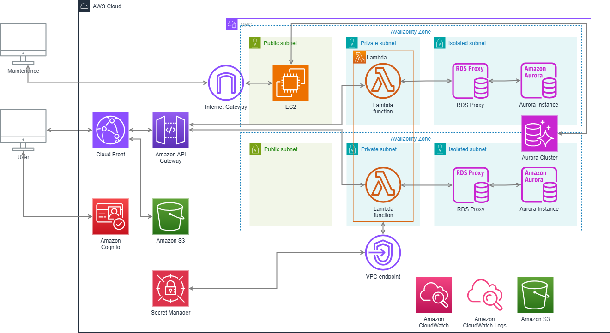

# cdk-example
AWS CDKにて、Cloud Front + S3 + Lambda + RDSの環境を構築するテンプレートです。`front`や`backend`には、動作させるための最低限のソースコードを配置する


## 構成 / components
このプロジェクトで作成されるインフラ構成は以下のとおり



* Cloud Front
* API Gateway
* Cognito
* Lambda
* S3
* Secret Manager
* EC2
* Aurora

## 動かすのに必要な要件 / Environments

* docker
* docker compose v2 
* nodejs 20
* [AWS CDK cli](https://docs.aws.amazon.com/ja_jp/cdk/v2/guide/cli.html)
* [AWS SAM cli](https://docs.aws.amazon.com/ja_jp/serverless-application-model/latest/developerguide/install-sam-cli.html)

## 構築手順 / deployment
### 事前準備

- 構築したいAWSアカウントの認証情報を[AWS CDKCLIにセキュリティ認証情報を設定する ](https://docs.aws.amazon.com/ja_jp/cdk/v2/guide/configure-access.html)
- `infra/.env`に環境情報を記載
    ``` 
    # AWSのアカウントID 1234567890
    ACCOUNT_ID=  
    # リージョン 例 ap-northeast-1
    REGION= 
    # SSHするときの公開鍵 例　ssh-ed25519 AAAA...
    SSH_PUB_KEY= 
    # アクセスを許可するIPv4アドレス 例 0.0.0.0/0
    ALLOW_SSH_IPS_SEPARATED_BY_COMMA= 
    # httpsにアクセスを許可するipv4アドレス 例 0.0.0.0
    ALLOW_HTTPS_IPS_SEPARATED_BY_COMMA=
    # アラートの送り先メールアドレス 例 example@example.com
    ALERT_EMAIL= 
    ```

### 構築

1. フロントのビルド
    ``` bash
    cd front/
    npm install
    npm run build
    ```

2. バックエンドのビルド
    ``` bash
    cd backend
    sam build
    ```

3. インフラ構築
    ``` bash
    cd infra
    npm install
    npx cdk deploy BaseInfraStack
    npx cdk deploy DatastoreStack
    npx cdk deploy ApplicationStack
    ```

4. CognitoのUserpool情報をフロントへ  
    `front/.env`にCognitoの情報を入れて再ビルドする
    ```
    VITE_COGNITO_USER_POOL_ID=
    VITE_COGNITO_CLIENT_ID=
    VITE_COGNITO_IDENTITY_POOL_ID=
    ```

    アプリケーションのみのdeployは、`ApplicationStack`のみ
    ``` bash
    cd infra
    npx cdk deploy ApplicationStack
    ```


これで完成です。Cloud FrontのURLにアクセスして、Sign upして試してみてください

## 使用方法 / Usage
### ローカル実行
- backend  
    バックエンドのローカル実行は、dockerでMySQLのDBを動かし`sam`で実行する
    ```
    cd backend
    docker compose up -d
    sam build
    sam local start-api --docker-network backend_lambda-network
    ```

    localhost:3000 でAPIが立ち上がる

- front  
    frontは、viteで起動する。ただしAPIの向き先をローカルにしておくこと

    `front/src/App.tsx:17`
    ``` javascript
    const response = await fetch('/api/hello/', {
    ```

    また、Cognitoは構築済みのものを`front/.env`に記述する

    起動は、`npm run dev`
    ```
    cd front
    npm run dev
    ```

### 環境の削除
基本的には、`destroy`で削除できるが、残るものがあるので注意。

- まずは、`loggingbucket`を手動で削除してから、`ApplicationStack`を削除する。

    ``` bash
    npx cdk destroy ApplicationStack
    ```

- DatastoreStackは事前にマネージドコンソールから、Aurola Clusterの削除保護を解除する。
    ``` bash
    npx cdk destroy DatastoreStack
    ```

- さらに事後、Aurola Clusterを手動で削除し、サブネットグループとパラメータグループを手動で削除し、もう一度Stackの削除を実行する
    ``` bash
    npx cdk destroy DatastoreStack
    ```

- 最後に、VPCを削除する
    ``` bash
    npx cdk destroy BaseInfraStack
    ```
 
## 注意点 / Note

Aurora Clusterがそこそこ高いので、コストに注意してください

## 作成者 / Author

* 松田康司
* 神戸デジタル・ラボ / 生産技術チーム
* k-matsuda@kdl.co.jp
 
# License
MIT License 